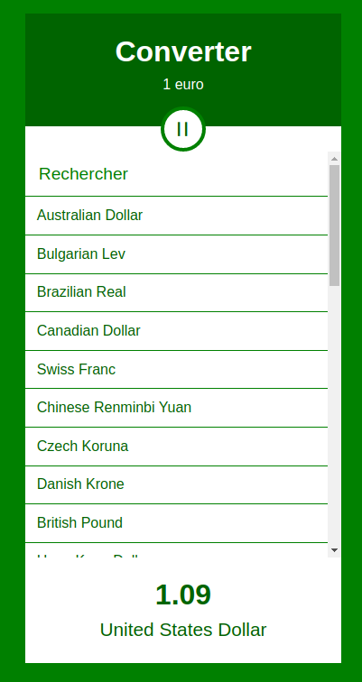

# CurrencyConverter 📈

Bienvenue dans CurrencyConverter, ma toute première application React ! 🎉 <br> 
En tant que novice dans le monde du développement React, je suis ravi de partager ce projet avec vous. Le Currency Converter est un projet React idéal pour les débutants, qui permet aux utilisateurs de convertir 1 euro en diverses devises. Les utilisateurs peuvent sélectionner une devise dans la liste fournie, et le montant converti s'affichera dans le pied de page. De plus, le convertisseur propose un bouton bascule pour afficher ou masquer la liste des devises, ainsi qu'un champ de recherche pour trouver facilement des devises spécifiques. <br><br>

<p align="center">
  
</p>

<br>

## Fonctionnalités :

🔄 **Currency Conversion:** Convertir 1 euro en différentes devises.

🔳 **Display/Hide Currency List:** Basculer la visibilité de la liste des devises à l'aide du bouton "=".

🔍 **Search Field Currency Filter:** Rechercher des devises spécifiques à l'aide du champ de recherche de devises.

## Les défis rencontrés :

### Components :

J'ai réussi à organiser l'application en différents composants pour garantir une base de code modulaire et facile à entretenir. En décomposant l'interface utilisateur en composants plus petits tels que Header, Currencies, Amount et Button, j'ai amélioré la lisibilité et la réutilisabilité du code.

### State (ou _état_) :

Comprendre et utiliser le concept de _state_ dans React était crucial pour ce projet. J'ai efficacement mis à jour les propriétés du state, telles que currenciesOpen, baseAmount, currencyName et inputSearch, pour obtenir un comportement dynamique et des mises à jour en temps réel.

### Props :

L'implémentation des props m'a permis de transmettre des données entre les composants parents et enfants de manière transparente. Cette fonctionnalité s'est avérée essentielle pour afficher le montant converti et gérer les événements de clic sur les devises.

### Classes :

Dans ce projet, l'utilisation des classes et la compréhension de leur rôle dans la gestion de l'état m'ont permis de faire une transition en douceur vers l'apprentissage des hooks React. Les hooks offrent une manière plus concise et intuitive de travailler avec le state et les fonctionnalités du cycle de vie. En construisant des bases solides avec les classes, j'ai pu apprécier les avantages des hooks et comprendre comment ils simplifient la logique des composants et améliorent la lisibilité du code.

### SASS :

Sass s'est révélé être un outil puissant pour gérer les styles efficacement. J'ai utilisé des variables du fichier _variables.scss pour maintenir des couleurs cohérentes dans toute l'application. L'imbrication des styles m'a permis d'écrire des règles CSS plus propres et mieux organisées.

## Installation via la console

#### 1. Cloner le dépôt là où vous le souhaitez :

```console
git clone https://github.com/AlexandreGomesDaSilva/CurrencyConverter.git
```

#### 2. Naviguez dans le répertoire du projet :

```console
cd chemin/vers-le-repo/CurrencyConverter
```

#### 3. Une fois dans le répertoire du projet, installez les dépendances nécessaires en utilisant Yarn :

```console
yarn install
```

ou 

```console
yarn
```

#### 4. Lancez le serveur de développement :

```console
yarn dev
```
